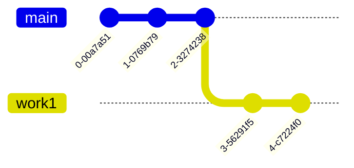

# git

前略、git、初歩的なポイントとよく使うコマンドを覚えてしまうと良い説。

## はじめに

- 初心者向け
  - tortoise Git とかでやってる
  - コマンド実行後にどういう形になるのか想像できていない
  - パターンで覚えていて、トラブルがあったときにつまずく

みたいな人向け。

# 基本的なところ

git は`ローカルリポジトリ`と、外部のリポジトリである`リモートリポジトリ`の二つに分けられる。
例えば、このドキュメントを管理しているローカルリポジトリは`.git`だし、リモートリポジトリは下記で確認できる。
```sh
➜ git remote -v
origin  https://github.com/nichijo/nichijo.github.io.git (fetch)
origin  https://github.com/nichijo/nichijo.github.io.git (push)
```

## WorkingTree, HEAD, Index(Stage)

色々と説明する前に、ひとまず下記三つの説明が必要なので、説明をする
- HEAD
- Index(Stage)
- WorkingTree

### HEAD

以下のような状態のリポジトリがある時


あなたがもし、mainブランチに居た場合、`HEAD`は`commitC`となり。

```sh
git checkout master
```


あなたがもし、developブランチに居た場合、`HEAD`は`commitDevC`となる。
```sh
git checkout develop
```


現在ブランチの先頭を指す参照と覚えておけばよい。
### WorkingTree, Index

`WorkingTree` は、HEADから変更された差分情報のことで、
`Index` は、後述の `git add` でステージングされたファイルのこと。


## add

`add` は、`WorkingTree`から任意のファイルを`Index(Stage)`に移動する。

下記のようにコマンドを実行する。
```sh
git add hoge.txt
git add fuga.txt
```


## branch

gitには`ブランチ`という機能がある。`ブランチ`は、簡単に言えばブランチごとにソースコードを分けておける機能で、複数の作業を同時進行するときや、お試しで幾つかのパターンで改修を加えるときなんかに使う。

現在のコミットログはこう。現在位置は`HEAD`

あなたは上司から、2件のアプリケーションの改修依頼を受けたとして…  
一つめの改修では `ViewA` と `GodClass` が。  
二つ目の改修では `ViewB` と `GodClass` の改修が必要になったとする


こういう場合、作業ごとにブランチを切ったほうが、作業が混沌としないで済む
```sh
git branch work1
git branch work2
```


作業１を進める。ある程度の作業ごとでコミットすると良いだろう


ブランチの切り替えには `checkout` を使う。例えば下記は work1 で作業中の状態。


チェックアウトをすると、ブランチのHEADへ移動する
移動すると、ファイルの状態もコミットの状態に戻る。
```sh
git checkout master
```


合間合間に作業２を進めても良い


仮に途中で作業が不要になったりしたらば、ブランチを消せばよい
```sh
git branch -D work2
```
通常 `git branch -d` で消すが、mainブランチにマージしていないとエラーが出て怒られる。
なので `git branch -D` として強制的に削除する。


最終的にはこうなる



## rebase

`rebase` は、ブランチを使うにあたって覚えておきたい機能の一つで、主に以下の用途で使われる。
1. 現在のブランチを、main等の親ブランチに追随させたい時
2. 現在のブランチの内容をコミットし直したい時

例えば `work1` に、mainの内容を反映させたいような時は…


```sh
# 現在 `work1` ブランチに居る
➜ git branch
  main
* work1
# rebase を実行する
➜ git rebase master
```
とするとこうなる


また、 `-i` オプションを使用することで、過去のコミットを奇麗にまとめあげることができる
（他にも、`commit --amend` と組み合わせて編集したり、ファイルを除外したりと色々できるので覚えて損はない）

```sh
# rebase を実行する
➜ git rebase -i master
```

```txt
pick work1-commit1 commit message1
pick work1-commit2 commit message2

# にゃんたらかんたら
```

のような感じで、過去のコミットの一覧が出てくるんで…
頭の「pick」の部分を変更することでそのコミットをまとめることができる

```txt
pick work1-commit1 commit message1   # コミットを採用
squash work1-commit2 commit message2 # 採用するがひとつ前のコミットにまとめる
```

これを実行すると


```
git checkout master
git merge work1
```


となり、奇麗にマージすることができる。

