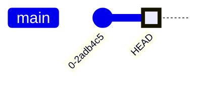
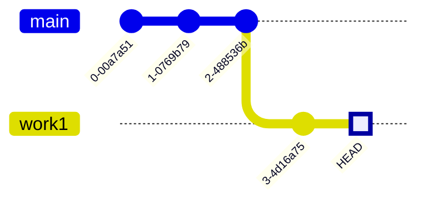

# git

前略、git使ってますか？初歩的なポイントとよく使うコマンドを覚えてしまいましょう。

## はじめに

- 初心者向けです
  - あまり使ったことがない
  - tortoise Git とかでやってる
  - commit pull push をよくわからないが使っている

みたいな人向けです。

## 基本的なところ

git はローカルリポジトリと、外部のリポジトリであるリモートリポジトリの二つに分けられる。
例えば、このドキュメントを管理しているローカルリポジトリは`.git`だし、リモートリポジトリは下記で確認できる。
```sh
➜ git remote -v
origin  https://github.com/nichijo/nichijo.github.io.git (fetch)
origin  https://github.com/nichijo/nichijo.github.io.git (push)
```

gitは、ローカルリポジトリだけで動作できる。
svnはサーバ上で生きていく存在だが、gitはただ、任意のディレクトリで`git init`とコマンドを打てばリポジトリが生成され、管理できる。

生まれたばかりのローカルリポジトリに、任意のファイルを管理させるには下記のようにする。
```sh
git add ./anyfiles.txt
git commit -m "commit message."
```

この時点でコミットログは下記の通りとなる。


再度任意のファイルを変更/追加してコミットするとこうなる


## add + commit

`add` は、任意のファイルをコミット対象とするかどうかを決める。
例えば、前回のコミットから、ローカルファイルに以下のファイルの変更があったとする。

- book.toml
- src/SUMMARY.md
- mermaid-init.js
- mermaid.min.js
- src/2023-04-07.md

どう変化しているかは `git status` コマンドで確認できる
```sh
➜ git status   
On branch main
Your branch is up to date with 'origin/main'.

Changes not staged for commit:
  (use "git add <file>..." to update what will be committed)
  (use "git restore <file>..." to discard changes in working directory)
        modified:   book.toml
        modified:   src/SUMMARY.md

Untracked files:
  (use "git add <file>..." to include in what will be committed)
        mermaid-init.js
        mermaid.min.js
        src/2023-04-07.md

no changes added to commit (use "git add" and/or "git commit -a")
```

以下は、以前のコミットから変更があったようだ
- book.toml
- src/SUMMARY.md

こちらは、新規のファイルのようだ
- mermaid-init.js
- mermaid.min.js
- src/2023-04-07.md

`git add` を使うと、この中から一部だけコミットすることができる

```sh
➜ git add .\book.toml .\mermaid-init.js .\mermaid.min.js 
```
```sh
➜ git status
On branch main
Your branch is up to date with 'origin/main'.

Changes to be committed:
  (use "git restore --staged <file>..." to unstage)
        modified:   book.toml
        new file:   mermaid-init.js
        new file:   mermaid.min.js

Changes not staged for commit:
  (use "git add <file>..." to update what will be committed)
  (use "git restore <file>..." to discard changes in working directory)
        modified:   src/SUMMARY.md

Untracked files:
  (use "git add <file>..." to include in what will be committed)
        src/2023-04-07.md
```
```sh
➜ git commit -m "add mermaid support"
[main 2339875] add mermaid support
 3 files changed, 1289 insertions(+)
 create mode 100644 mermaid-init.js
 create mode 100644 mermaid.min.js
 ```

かくしてコミットログは下記のようになった


## branch

gitには`ブランチ`という機能があり…あるコミットから、ソースコードの独立性を維持しながら複数の開発を進めることができる。
svnのブランチよりも気軽に扱えるため、gitを使う上では欠かせない機能といえる。

現在のコミットログはこう。現在位置は`HEAD`

あなたは上司から、2件のアプリケーションの改修依頼を受けたとしよう。  
一つめの改修では `ViewA` と `GodClass` が。  
二つ目の改修では `ViewB` と `GodClass` の改修が必要だ！


こういう場合、作業ごとにブランチを切ったほうが、作業が混沌としないで済む
```sh
git branch work1
git branch work2
```


作業１を進める。ある程度の作業ごとでコミットすると良いだろう


ブランチの切り替えには `checkout` を使う。例えば下記は work1 で作業中の状態。


チェックアウトをすると、ブランチのHEADへ移動する
移動すると、ファイルの状態もコミットの状態に戻る。
```sh
git checkout master
```


合間合間に作業２を進めても良い


仮に途中で作業が不要になったりしたらば、ブランチを消せばよい
```sh
git branch -D work2
```
通常 `git branch -d` で消すが、mainブランチにマージしていないとエラーが出て怒られる。
なので `git branch -D` として強制的に削除する。